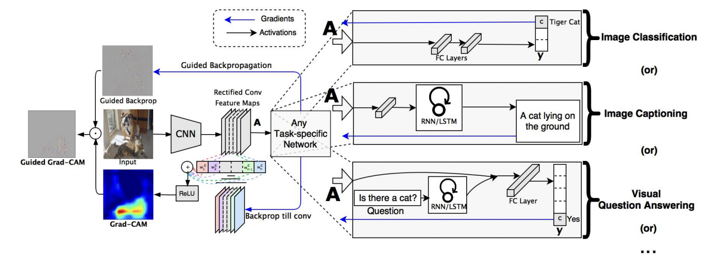
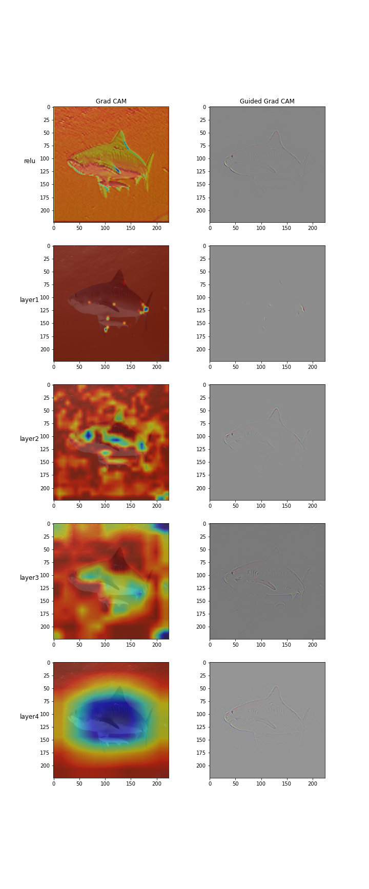

# Explainable CNNs

Its a common notion that a Deep Learning model is considered as a black box. Working towards this problem, this project focusses on making the internal working of the Neural layers more transparent. In order to do so, Explainable CNNs is a plug n play component that visualizes the layers based on on their gradients and builds different representations including Saliency Map, GuidedBackPropagation, gradCam and guidedgradCam. 

### Architechture

</img>

### Usage

Install the package 

```
pip install explainable-cnn
```

To create visualizations, create an instance of `CNNExplainer`

```
x_cnn = CNNExplainer(...)
```

The following method calls returns different visualizations 

```
saliency_map = x_cnn.get_saliency_map(...)

grad_cam = x_cnn.get_grad_cam(...)

guided_grad_cam = x_cnn.get_guided_grad_cam(...)
```

<p>To see full list of arguments and their usage, please refer to <a href="examples/explainable_cnn_usage.ipynb">this notebook</a></p>

### Output

<p>Below is a comparison of the visualization generated using gradCam and guidedGradCam </p>

</img>

### Contributors

<!-- ALL-CONTRIBUTORS-LIST:START - Do not remove or modify this section -->
<!-- prettier-ignore-start -->
<!-- markdownlint-disable -->
<table>
  <tr>
    <td align="center"><a href="https://github.com/buildingamind"><br /><sub><b>Building A Mind Lab</b></sub></a><br /><a href="https://github.com/L-Pandey/CHICKAI/commits?author=buildingamind" title="Code">💻</a> <a href="#research-buildingamind" title="Research">🔬</a> <a href="#ideas-buildingamind" title="Ideas, Planning, & Feedback">🤔</a> <a href="#design-buildingamind" title="Design">🎨</a></td>
    <td align="center"><a href="https://github.com/L-Pandey"><br /><sub><b>Lalit Pandey</b></sub></a><br /><a href="https://github.com/L-Pandey/CHICKAI/commits?author=buildingamind" title="Code">💻</a> <a href="#research-buildingamind" title="Research">🔬</a> <a href="#ideas-buildingamind" title="Ideas, Planning, & Feedback">🤔</a> <a href="#design-buildingamind" title="Design">🎨</a></td>
    
  </tr>
</table>


### References

<a href="https://arxiv.org/pdf/1610.02391.pdf"> Grad-CAM: Visual Explanations from Deep Networks
via Gradient-based Localization</a>
